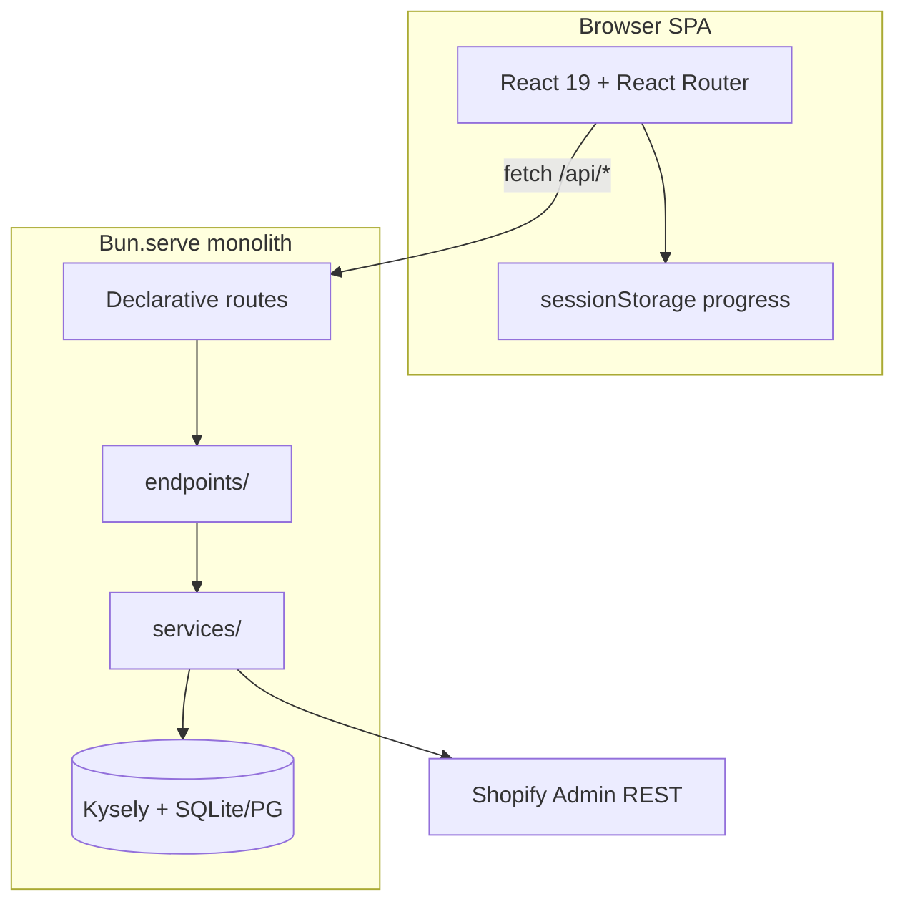

<p align="center">
  
</p>

# Madeon Promo Game

Email → mini-game → one-time Shopify discount code. Live on Railway.

**Games:** sliding puzzle, chess, Aces Up solitaire, 2048.

## Architecture



Single Bun process serves the React SPA (catch-all `/*`), JSON API routes, and static assets. Shared code is organized as:

| Folder           | Purpose                                             |
| ---------------- | --------------------------------------------------- |
| `src/types/`     | TypeScript shapes (API, DB, session, progress)      |
| `src/constants/` | Literal values (game IDs, timing limits, store URL) |
| `src/lib/`       | Pure helpers derived from types + constants         |

Completion requests are validated server-side against session start time and per-game minimum play durations.

## Stack

Bun · React (HTML import) · Kysely · SQLite locally / Postgres on Railway · Shopify Admin REST

## Setup

```bash
bun install
cp .env.example .env
bun run dev   # http://localhost:3847
```

Without `SHOPIFY_*` in dev, codes are mocked (`MADEON-DEV-…` in the terminal).

| Variable                                     | Purpose                                                      |
| -------------------------------------------- | ------------------------------------------------------------ |
| `DATABASE_URL`                               | Postgres (Railway). Omit for local SQLite at `DATABASE_PATH` |
| `SHOPIFY_ADMIN_TOKEN`, `SHOPIFY_SHOP_DOMAIN` | Discount minting                                             |
| `SHOPIFY_DISCOUNT_PERCENT`                   | Default `10`                                                 |
| `ADMIN_SECRET`                               | `/analytics` stats dashboard                                 |
| `BUN_PUBLIC_STORE_URL`                       | Checkout links + QR (default `https://madeon.store`)         |

## API

| Route               | Method | Body / auth                                                                     |
| ------------------- | ------ | ------------------------------------------------------------------------------- |
| `/api/start`        | POST   | `{ email, game? }` → `{ sessionId }`                                            |
| `/api/complete`     | POST   | `{ sessionId, email, completionTimeMs, game?, score? }` → `{ code, offerText }` |
| `/api/leaderboard`  | GET    | `?game=puzzle\|chess\|solitaire\|game2048`                                      |
| `/api/analytics`    | GET    | `x-admin-secret` or `?key=`                                                     |
| `/api/dev/complete` | POST   | Same as complete; **404 in production**                                         |

One code per email. Replay visits reuse the same code.

`/api/complete` validates completion time against the session's `started_at` (wall-clock ceiling) and per-game minimums (puzzle 3s, chess 5s, solitaire 10s, 2048 15s). Sessions expire after 24 hours. Dev skip (`/api/dev/complete`) bypasses timing checks.

## Local dev shortcuts

- **Dev: skip to code** toolbar button on `localhost` only.
- **Stats** `/analytics` with `ADMIN_SECRET`.
- **Skip via curl** (non-production):

```bash
curl -X POST http://localhost:3847/api/dev/complete \
  -H 'Content-Type: application/json' \
  -d '{"sessionId":"…","email":"you@example.com","completionTimeMs":5000,"game":"puzzle"}'
```

## Scripts

```bash
bun run dev          # hot reload
bun run start        # production server
bun run typecheck
bun run lint
bun run format:check
```

Static assets live in `public/` (`/images/*`, `/fonts/*`).
